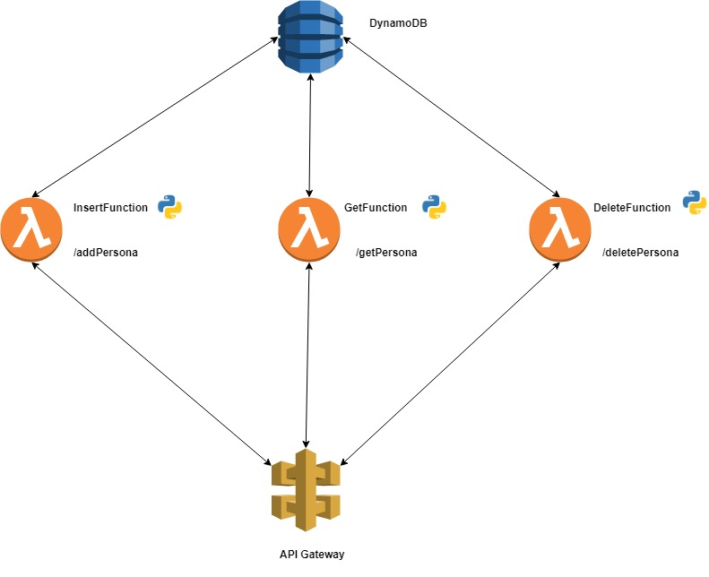

# API GATEWAY | CLOUD FORMATION EXERCISE

* The purpose of this excercise is to create a Serverless API using Lambda Functions, API Gateway and DynamoDB

## Diagram

# Main.yml

 ### Parameters
<!---->
| Parameter      | Description | Type    |
| :---        |    :----:   |          ---: |
| Template     | S3 Bucket  in which the templates are stored     |   String |
| TableID     | Name for the ID in the DynamoDB's table   |   String |
| TypeID     |  Type for the ID in the DynamoDB's table  |   String |
| NameTable     |  Name for the DybamoDB Table |   String |
<!---->

### Resources

#### Dynamo Stack
* This stack is in charge of creating the resources in the dbStack.yml file. This file will create the dynamoDB's table
* Stack Definition: dbStack.yml

##### Parameters sended to the template
<!---->
| Parameter      | Description | Type    |
| :---        |    :----:   |          ---: |
| IDTable     | Name for the ID in the DynamoDB's table    |   String |
| IDType     | Type for the ID in the DynamoDB's table    |   String |
| Name     |  Name for the DybamoDB Table |   String |
<!---->

#### Lambda Stack
* This stack is in charge of creating the lambda functions that will interact with dynamoDB
* Stack Definition: lambda.yml

##### Parameters sended to the template
<!---->
| Parameter      | Description | Type    |
| :---        |    :----:   |          ---: |
| IDTable     | Name for the ID in the DynamoDB's table    |   String |
| Bucket     | Name of the bucket in S3    |   String |
<!---->

#### API Stack
* This stack is in charge of creating the API
* Stack Definition: api.yml

##### Parameters sended to the template
<!---->
| Parameter      | Description | Type    |
| :---        |    :----:   |          ---: |
| FuncAddPerson     | ARN of the lambda function that adds a person to the table   |   String |
| FuncGetPersona     | ARN of the lambda function that gets all itmes in the table    |   String |
| FuncDeletePersona     | ARN of the lambda function that deletes a person to the table    |   String |
<!---->
